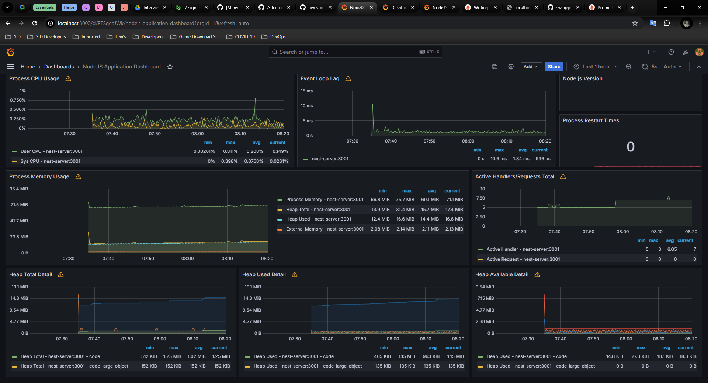
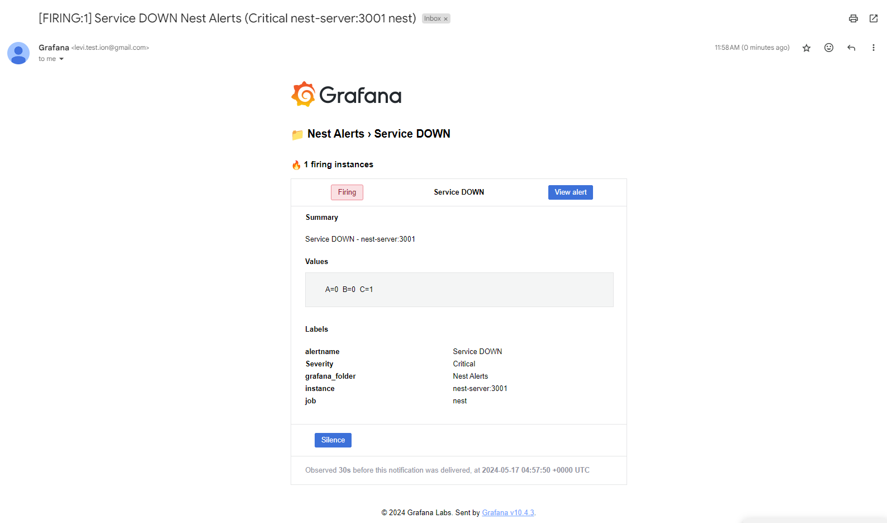

## Prerequisites

- [Docker](https://www.docker.com/) installed and Docker Engine is running
- External docker network "dockerized-nest", use this command:
  ```bash
  docker network create dockerized-nest
  ```

### Steps to run the modified NestJS application and basic monitoring services

1. Change directory to [`./dockerized-nest`](./dockerized-nest)
2. Run `docker compose up -d`
3. Change directory to [`./prometheus-grafana`](./prometheus-grafana)
4. Run `docker compose up`

   Also, can use flag `-d` to make it a daemon / running in background.

5. Visit http://localhost:3001/metrics to see all the default metrics current values of the NestJS application.
6. Visit http://localhost:9090 to access Prometheus default UI.
7. Visit http://localhost:3000 to access Grafana (data visualization / dashboards), login with user: `admin`, password: `grafana` (as stated in the env vars in `compose.yaml`)



### Steps taken to setup basic monitoring for the NestJS application

- Configure the NestJS application to have `/metrics` endpoint to be consumed by Prometheus, see [this](github.com/willsoto/nestjs-prometheus?tab=readme-ov-file#installation) for more details. The differences are npm-installed `@willsoto/nestjs-prometheus` and `prom-client` and some code changes in [`./dockerized-nest/nest/sample/03-microservices/src/app.module.ts`](./dockerized-nest/nest/sample/03-microservices/src/app.module.ts), can compare with [/dockerize-nest/nest/sample/03-microservices/src/app.module.ts](/dockerize-nest/nest/sample/03-microservices/src/app.module.ts).
- Configured the same network for container `prometheus`, `nest-server`, and `grafana`.
- Configured `prometheus.yml` to include `nest-server` as one of the targets for metrics scraping.
- In Grafana Dashboards, can import using the ID `11159`, or see [this page](https://grafana.com/grafana/dashboards/11159-nodejs-application-dashboard/) for more details. Use the default Prometheus as the data source. Exported it and added in Grafana provisioning mechanisms.
- Setup alert with Grafana, see [this video](https://www.youtube.com/watch?v=6W8Nu4b_PXM) for help. Exported all the relevant YAMLs and added them via Grafana provisioning mechanisms.

Example when it is firing to the email notification channel:



### References

- [Monitoring | Awesome NestJS](https://awesome-nestjs.com/components-and-libraries/monitoring.html)
