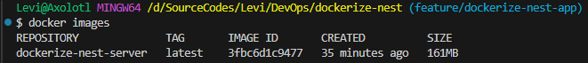

## Prerequisites

- [Docker](https://www.docker.com/) installed and Docker Engine is running
- [Node](https://nodejs.org/en/download) v20.13.1 installed
  - Preferably installed via [NVM (Node Version Manager)](https://github.com/nvm-sh/nvm)
- Git submodule [`/dockerize-nest/nest`](./nest) initiated

### Build the Docker image and run it locally

- Change directory to [`/dockerize-nest`](/dockerize-nest)
- Execute this command:
  ```bash
  docker compose up
  ```
  Also, can use flag `-d` to make it a daemon / running in background.
- The application is running on: http://[::1]:3001 or http://localhost:3001
- To stop it, use this command:
  ```bash
  docker compose down
  ```

The size of the Docker image is ~161MB.



### Steps taken for containerizing the NestJS application

- Execute `docker init` in the root folder of the project [`./nest`](./nest)
- Input the desired configs whenever prompted (interactive)
- [Optional] Refactor/move the generated files to another directory, do not forget to change the relative paths written in each generated files according to the directory where the files have been moved to.

Example:


